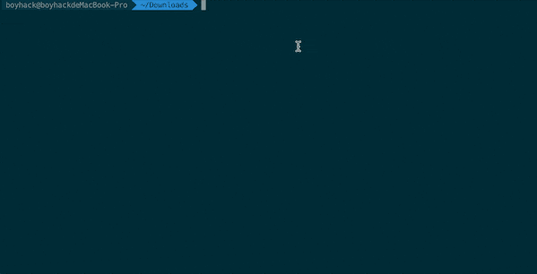

[](https://twitter.com/intent/follow?screen_name=Hktalent3135773) [](https://twitter.com/intent/follow?screen_name=Hktalent3135773) [](https://github.com/hktalent/)
[](https://51pwn.com)

(该仓库为二次集成开发、分布式、多任务而重构)

（VIP user https://51pwn.com）
## 特性和Tips
- 2023-11-20
   * 支持 【* 前缀,*.hackerone.com】，或者 * 在中间的情况
   * 支持 【后缀 *,hackerone.*】，共计 9744 种后缀，所以非必要，不建议 * 后缀，否则将超过 298 亿次迭代
   * 支持 【中间 *,www.paypal-*.com】
- 2023-04-03
   * 合并 https://codeload.github.com/n0kovo/n0kovo_subdomains/zip/refs/heads/main 字典到 config/subdomain.txt,并优化其中无效数据
   * 字典数量 累计 3065536 【306万+】个
- 2023-01-13
    * 增加结果自动记录大数据搜索引擎(config/config.json)
    * 所有异步优化到可控线程池
    * 增加字典 -f 默认字典 config/subdomain.txt，包含了 data 下两个字典的合并、去重
    * 优化内存开销，降低到600M内，修复原来版本内存泄漏的bug--原版扫描结果超过200万后内存泄漏到 > 30G
  

## 安装
1. 下载二进制 https://github.com/hktalent/ksubdomain/releases
2. 安装libpcap环境
   - Windows
     下载`npcap`驱动，winpcap驱动有人反馈无效
   - Linux
     已经静态编译打包libpcap，无需其他操作
   - MacOS
     自带 libpcap,无需其他操作
3. 执行!
### 快速安装
需要`go 1.21.3`以上版本并安装`libpcap`环境，运行以下命令
```
go install -v github.com/hktalent/ksubdomain/cmd/ksubdomain@latest
```

## Useage
```bash
NAME:
   KSubdomain - 无状态子域名爆破工具

USAGE:
   ksubdomain [global options] command [command options] [arguments...]

VERSION:
   1.8.6

COMMANDS:
   enum, e    枚举域名
   verify, v  验证模式
   test       测试本地网卡的最大发送速度
   help, h    Shows a list of commands or help for one command

GLOBAL OPTIONS:
   --help, -h     show help (default: false)
   --version, -v  print the version (default: false)

```

## 一种用法
list.txt
内容如下，表示需要对下面的列表后缀进行遍历
```
com
edu
gov
edu.cn
gov.cn
```
命令,设定500M带宽，输出为json
需要特别注意的是，看上去成功数为几百万，实际得到有效的会更少，因为有的域名返回的ip是"0.0.0.1"，在结果中直接过滤掉了
```
cat  list.txt|./ksubdomain e -stdin --band 500m -o list_All.json -json 
```
other
```
cat $HOME/MyWork/bug-bounty/data/hk1/hk1.txt|./ksubdomain e -stdin --band 500m -o hk1.json -json
cat <<EOT>/usr/local/bin/doSubdomain
xx=`pwd`
cd $HOME/MyWork/ksubdomain
CNum=1000000
./ksubdomain e -d $1 --band 500m -o $1.json -json -l 2
mv $1.txt $xx/

EOT
chmod +x /usr/local/bin/doSubdomain
```
### 模式

**验证模式**
提供完整的域名列表，ksubdomain负责快速获取结果

```bash
./ksubdomain verify -h

NAME:
   ksubdomain verify - 验证模式

USAGE:
   ksubdomain verify [command options] [arguments...]

OPTIONS:
   --filename value, -f value   验证域名文件路径
   --band value, -b value       宽带的下行速度，可以5M,5K,5G (default: "2m")
   --resolvers value, -r value  dns服务器文件路径，一行一个dns地址
   --output value, -o value     输出文件名
   --silent                     使用后屏幕将仅输出域名 (default: false)
   --retry value                重试次数,当为-1时将一直重试 (default: 3)
   --timeout value              超时时间 (default: 6)
   --stdin                      接受stdin输入 (default: false)
   --only-domain, --od          只打印域名，不显示ip (default: false)
   --not-print, --np            不打印域名结果 (default: false)
   --dns-type value             dns类型 1为a记录 2为ns记录 5为cname记录 16为txt (default: 1)
   --help, -h                   show help (default: false)
```

```
从文件读取 
./ksubdomain v -f dict.txt

从stdin读取
echo "www.hacking8.com"|./ksubdomain v --stdin

读取ns记录
echo "hacking8.com" | ./ksubdomain v --stdin --dns-type 2
```

**枚举模式**
只提供一级域名，指定域名字典或使用ksubdomain内置字典，枚举所有二级域名

```bash
./ksubdomain enum -h

NAME:
   ksubdomain enum - 枚举域名

USAGE:
   ksubdomain enum [command options] [arguments...]

OPTIONS:
   --band value, -b value          宽带的下行速度，可以5M,5K,5G (default: "2m")
   --resolvers value, -r value     dns服务器文件路径，一行一个dns地址
   --output value, -o value        输出文件名
   --silent                        使用后屏幕将仅输出域名 (default: false)
   --retry value                   重试次数,当为-1时将一直重试 (default: 3)
   --timeout value                 超时时间 (default: 6)
   --stdin                         接受stdin输入 (default: false)
   --only-domain, --od             只打印域名，不显示ip (default: false)
   --not-print, --np               不打印域名结果 (default: false)
   --dns-type value                dns类型 1为a记录 2为ns记录 5为cname记录 16为txt (default: 1)
   --domain value, -d value        爆破的域名
   --domainList value, --dl value  从文件中指定域名
   --filename value, -f value      字典路径
   --skip-wild                     跳过泛解析域名 (default: false)
   --level value, -l value         枚举几级域名，默认为2，二级域名 (default: 2)
   --level-dict value, --ld value  枚举多级域名的字典文件，当level大于2时候使用，不填则会默认
   --help, -h                      show help (default: false)
```

```
./ksubdomain e -d baidu.com

从stdin获取
echo "baidu.com"|./ksubdomain e --stdin
```

# How ...
- pcap打开失败:enxx: You don't have permission to capture on that device ((cannot open BPF device) /dev/bpf0: Permission denied)
```
go build -o ksubdomain main.go;cp ksubdomain ~/go/bin/ 
sudo chgrp staff /dev/bpf*
cat $HOME/MyWork/bounty-targets-data/data/hackerone_data.json|jq ".[].targets.in_scope[0].asset_identifier"|grep -v 'null'
cat $HOME/MyWork/bounty-targets-data/data/hackerone_data.json|jq ".[].targets.in_scope[0].asset_identifier"|grep '"\*\.'|sed 's/"//g'|sed 's/^\*\.//g' >lists.txt
echo $PPSSWWDD| sudo -S ./ksubdomain enum -b 5M --dl lists.txt -f $HOME/MyWork/scan4all/config/database/subdomain.txt
```

## 特性和Tips
- 无状态爆破，有失败重发机制，速度极快
- 中文帮助，-h会看到中文帮助
- 两种模式，枚举模式和验证模式，枚举模式内置10w字典
- 将网络参数简化为了-b参数，输入你的网络下载速度如-b 5m，将会自动限制网卡发包速度。
- 可以使用./ksubdomain test来测试本地最大发包数
- 获取网卡改为了全自动并可以根据配置文件读取。
- 会有一个时时的进度条，依次显示成功/发送/队列/接收/失败/耗时 信息。
- 不同规模的数据，调整 --retry --timeout参数即可获得最优效果
- 当--retry为-1，将会一直重试直到所有成功。
- 支持爆破ns记录

## 与massdns、dnsx对比

使用100w字典，在4H5M的网络环境下测试

|          | ksubdomain                                                   | massdns                                                      | dnsx                                                         |
| -------- | ------------------------------------------------------------ | ------------------------------------------------------------ | ------------------------------------------------------------ |
| 支持系统 | Windows/Linux/Darwin                                         | Windows/Linux/Darwin                                         | Windows/Linux/Darwin                                         |
| 功能 | 支持验证和枚举 | 只能验证 | 只能验证 |
| 发包方式 | pcap网卡发包                                                 | epoll,pcap,socket                                            | socket                                                       |
| 命令行 | time ./ksubdomain v -b 5m -f d2.txt -o ksubdomain.txt -r dns.txt --retry 3 --np | time ./massdns -r dns.txt -t AAAA -w massdns.txt d2.txt --root -o L | time ./dnsx -a -o dnsx.txt -r dns.txt -l d2.txt -retry 3 -t 5000 |
| 备注   | 加了--np 防止打印过多                                        |                                                              |                                                              |
| 结果   | 耗时:1m28.273s<br />成功个数:1397                            | 耗时:3m29.337s<br />成功个数:1396                            | 耗时:5m26.780s <br />成功个数:1396                           |

ksubdomain只需要1分半，速度远远比massdns、dnsx快~

## 参考

- 原ksubdomain https://github.com/knownsec/ksubdomain
- 从 Masscan, Zmap 源码分析到开发实践 <https://paper.seebug.org/1052/>
- ksubdomain 无状态域名爆破工具介绍 <https://paper.seebug.org/1325/>
- [ksubdomain与massdns的对比](https://mp.weixin.qq.com/s?__biz=MzU2NzcwNTY3Mg==&mid=2247484471&idx=1&sn=322d5db2d11363cd2392d7bd29c679f1&chksm=fc986d10cbefe406f4bda22f62a16f08c71f31c241024fc82ecbb8e41c9c7188cfbd71276b81&token=76024279&lang=zh_CN#rd) 


# Communication group (WeChat, QQ，Tg)
|Wechat|Or|QQchat|Or|Tg|
|---|---|---|--- |--- |
|  ||  ||  |


## 💖Star
[](https://starchart.cc/hktalent/ksubdomain)

# Donation
| Wechat Pay | AliPay | Paypal | BTC Pay |BCH Pay |
| --- | --- | --- | --- | --- |
|||[paypal](https://www.paypal.me/pwned2019) **miracletalent@gmail.com**|||

<!--
cat $HOME/MyWork/bug-bounty/data/bounty-targets-data/data/hackerone_data.json|jq '.[].targets.in_scope[].asset_identifier'|grep -E '\*|https:\/\/'|grep -E "\*\."|tr ', ' '\n'|tr -d '"' |sort -u|sed -E 's/http(s)?:\/\/\*/\*/g' |sed -E 's/\/.*$|\*$//g'>$HOME/MyWork/ksubdomain/hk1.txt


-->